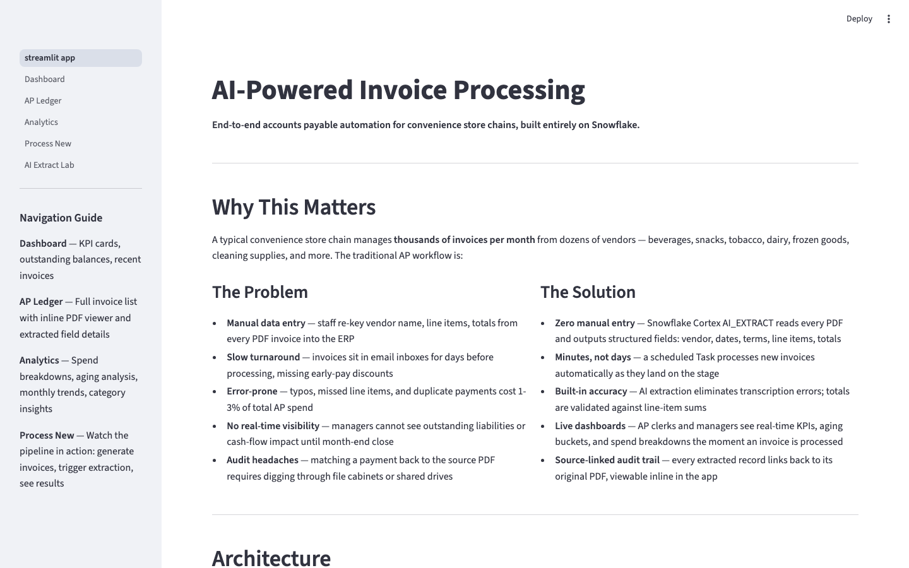
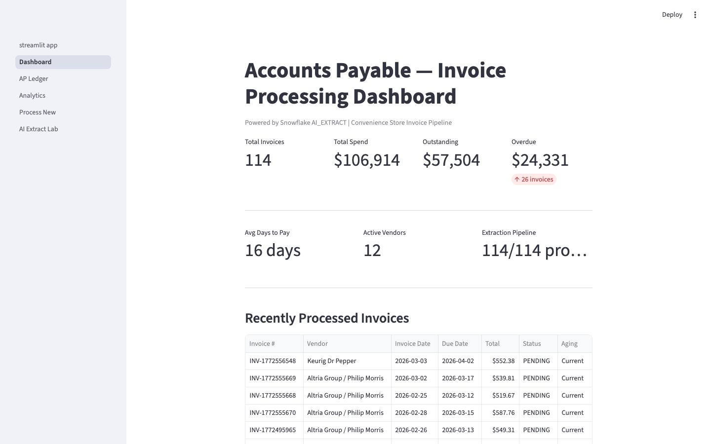
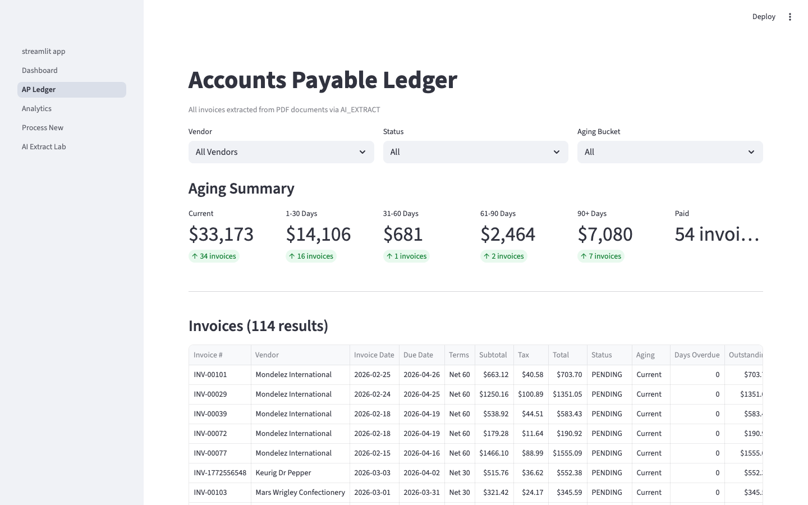
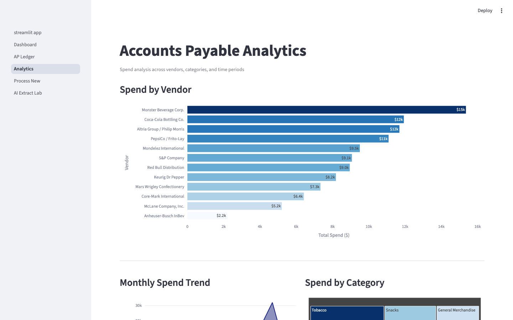
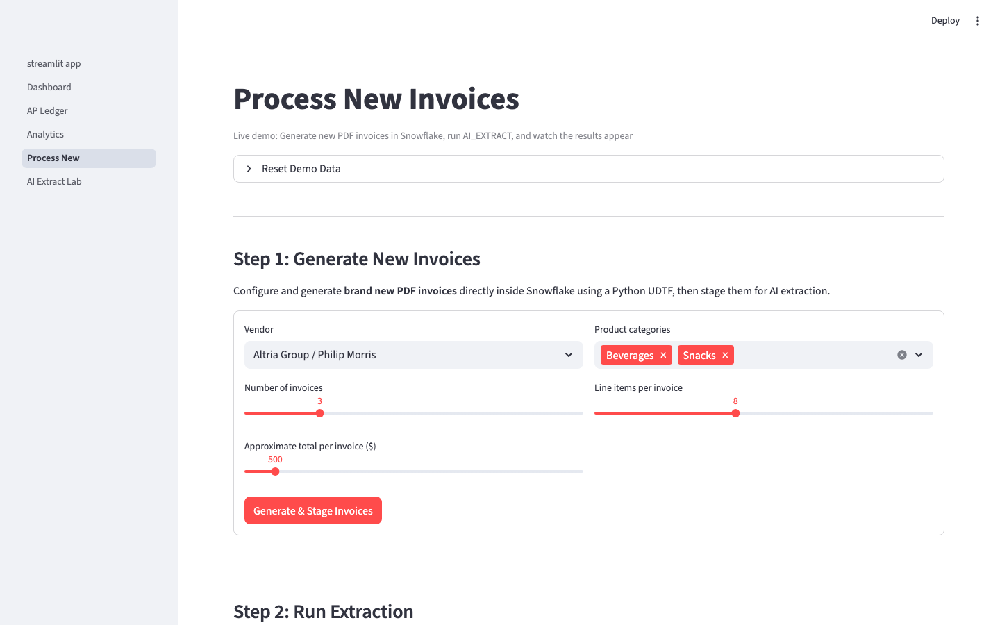
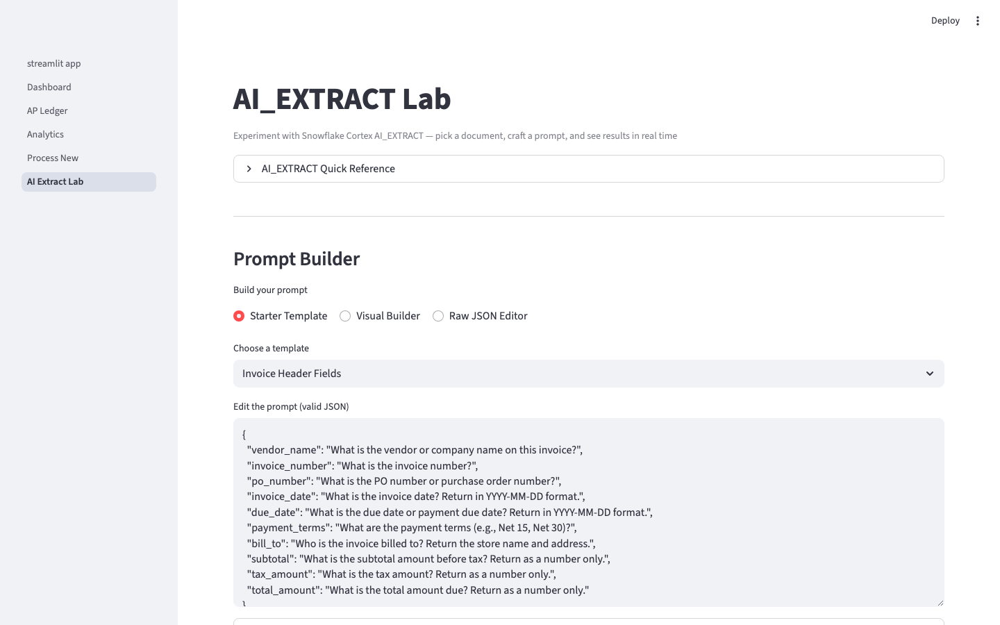

# Convenience Store Accounts Payable — AI Invoice Processing

> Turn a pile of PDF invoices into a structured, queryable accounts payable system — using nothing but Snowflake.

## Why This Matters

Convenience store chains receive hundreds of paper and PDF invoices every month from distributors like McLane, Core-Mark, Coca-Cola, and Frito-Lay. Most AP teams still process these manually — keying in vendor names, line items, and totals by hand, then reconciling against purchase orders in spreadsheets. It's slow, error-prone, and expensive.

This project demonstrates a **fully automated alternative** built entirely on Snowflake:

1. **Drop PDFs on a stage** — no external file servers, S3 buckets, or integrations needed
2. **AI reads every invoice** — Cortex AI_EXTRACT pulls structured data (vendor, dates, terms, line items, totals) from each PDF with zero training or model configuration
3. **New invoices process themselves** — a Stream + Task pipeline detects new files and extracts them automatically every 5 minutes
4. **See everything in one app** — a Streamlit dashboard shows the AP ledger, aging buckets, spend analytics, and lets you run live extraction demos

The entire stack — ingestion, extraction, automation, and visualization — runs inside Snowflake. No external services, no API keys, no infrastructure to manage.



---

## Features

### KPI Dashboard
Real-time metrics — total invoices, outstanding balance, active vendors, processing rate — plus a recent invoices table.



### AP Ledger with Invoice Drill-Down
Full invoice list with aging buckets, vendor/status/aging filters, and inline PDF rendering. Select any invoice to see extracted header fields, line items, and the original source PDF side-by-side.



### Spend Analytics
Six analytical views power interactive Plotly charts: spend by vendor (horizontal bar), monthly spend trend (area), spend by category (treemap), aging distribution (color-coded bar), top 20 products by spend (table), and vendor payment terms summary.



### Process New Invoices
Live extraction pipeline demo. Generate new PDF invoices using the in-Snowflake UDTF, trigger batch extraction with AI_EXTRACT, and watch results populate in real time. Configurable vendor selection, invoice count, and product categories.



### AI Extract Lab
Interactive prompt builder for Cortex AI_EXTRACT. Three modes — Starter Template (pre-built prompts for invoice headers, line items, general Q&A), Visual Builder (point-and-click entity definition), and Raw JSON Editor. Test extraction against any staged or uploaded PDF.



---

## Architecture

```
PDF Invoices ──► Snowflake Internal Stage (@INVOICE_STAGE)
                        │
                        ▼
                  RAW_INVOICES (file metadata via DIRECTORY())
                        │
                        ▼
                  Stream (CDC tracking)
                        │
                        ▼
                  Scheduled Task (every 5 min, stream-gated)
                        │
                        ▼
                  Cortex AI_EXTRACT (entity + table extraction)
                        │
                        ▼
              ┌─────────┴──────────┐
              ▼                    ▼
     EXTRACTED_INVOICES    EXTRACTED_LINE_ITEMS
              │                    │
              └────────┬───────────┘
                       ▼
               8 Analytical Views
                       │
                       ▼
              Streamlit App (Container Runtime)
```

### Snowflake Objects Created

| Category | Objects |
|----------|---------|
| Database | Your chosen database |
| Schema | Your chosen schema |
| Warehouse | X-Small, auto-suspend 120s |
| Compute Pool | `CPU_X64_XS`, 1 node, auto-suspend 300s |
| Stages | `INVOICE_STAGE` (internal, directory enabled), `STREAMLIT_STAGE` (app files) |
| Tables | `RAW_INVOICES`, `EXTRACTED_INVOICES`, `EXTRACTED_LINE_ITEMS`, `VENDORS` (12 seeded) |
| Views | `V_AP_LEDGER`, `V_AGING_SUMMARY`, `V_SPEND_BY_VENDOR`, `V_SPEND_BY_CATEGORY`, `V_MONTHLY_TREND`, `V_TOP_LINE_ITEMS`, `V_VENDOR_PAYMENT_TERMS`, `V_EXTRACTION_STATUS` |
| Stream | `RAW_INVOICES_STREAM` |
| Task | `EXTRACT_NEW_INVOICES_TASK` (5-min schedule) |
| Stored Proc | `SP_EXTRACT_NEW_INVOICES` |
| UDTF | `GENERATE_INVOICE_PDF` (Python, writes PDFs to stage) |
| Streamlit | App on Container Runtime |
| EAI | `PYPI_ACCESS_INTEGRATION` (required for container runtime) |

### Tech Stack

- **Snowflake Cortex AI_EXTRACT** — document intelligence (entity + table extraction)
- **Streamlit in Snowflake** — Container Runtime (`SYSTEM$ST_CONTAINER_RUNTIME_PY3_11`)
- **Plotly** — interactive charts (bar, area, treemap)
- **pypdfium2** — inline PDF rendering from stage
- **reportlab / fpdf** — PDF invoice generation (local + in-Snowflake UDTF)
- **Playwright** — E2E test automation and screenshot capture

---

## Prerequisites

- Snowflake account with **Cortex AI_EXTRACT** enabled
- `ACCOUNTADMIN` role (or equivalent privileges)
- `snow` CLI ([Snowflake CLI](https://docs.snowflake.com/en/developer-guide/snowflake-cli/index))
- Python 3.11+
- [uv](https://docs.astral.sh/uv/) package manager (recommended)

---

## Quick Start

### One-Command Deploy

```bash
./deploy.sh
```

This runs all 6 steps:

1. **Generate invoices** — creates 100 + 5 demo PDF invoices via `data/generate_invoices.py`
2. **Create Snowflake objects** — database, schema, warehouse, stage, compute pool (`sql/01_setup.sql`)
3. **Create tables** — 4 tables + vendor seed data (`sql/02_tables.sql`)
4. **Stage PDFs** — uploads all invoices to `@INVOICE_STAGE`
5. **Run batch extraction** — AI_EXTRACT on 100 invoices, then sets up stream/task/views (`sql/03-07`)
6. **Deploy Streamlit** — uploads app files and creates the Streamlit app on Container Runtime

### Customizing Deployment

All deployment parameters can be overridden via environment variables:

```bash
# Deploy to a custom database/schema
AP_DB=MY_DB AP_SCHEMA=MY_SCHEMA AP_WAREHOUSE=MY_WH ./deploy.sh

# Deploy using a specific Snowflake CLI connection
AP_CONNECTION=my_connection ./deploy.sh
```

| Variable | Default | Description |
|----------|---------|-------------|
| `AP_DB` | `AP_DEMO_DB` | Target database name |
| `AP_SCHEMA` | `AP` | Target schema name |
| `AP_WAREHOUSE` | `AP_DEMO_WH` | Warehouse name |
| `AP_COMPUTE_POOL` | `AP_DEMO_POOL` | Compute pool name |
| `AP_CONNECTION` | `aws_spcs` | Snowflake CLI connection name |

### Teardown

```bash
./teardown.sh
```

Drops all Snowflake objects created by the deploy script. Supports the same environment variables as `deploy.sh`.

---

## Dual-Environment Deployment

The Streamlit app uses a **dynamic config** module (`streamlit/config.py`) that reads `CURRENT_DATABASE()` and `CURRENT_SCHEMA()` at runtime. This means the same source code deploys to any Snowflake account with zero changes:

```python
# streamlit/config.py — all pages import DB and STAGE from here
from config import DB, STAGE
conn.query(f"SELECT * FROM {DB}.EXTRACTED_INVOICES")
stage_path = f"@{STAGE}/{file_name}"
```

No environment variables, no if/else branches, no hardcoded database names. The app resolves its own context at startup.

### Deploying to a Second Account

1. Set up your SQL objects using the numbered scripts in `sql/` (or `deploy.sh` with env var overrides)
2. Upload the `streamlit/` files to your `STREAMLIT_STAGE`
3. Create the Streamlit app — it will automatically use whatever database/schema it's deployed in

---

## Grants / Access Control

### Role-Based Access

Run `sql/08_grants.sql` to grant access on all objects to a specified role:

```bash
snow sql -c <connection> -f sql/08_grants.sql
```

Edit the `target_role` variable at the top of the file to match your target role. The script is idempotent — safe to re-run at any time.

### Future Grants Limitation

`GRANT ... ON FUTURE TABLES/VIEWS` requires the `MANAGE GRANTS` privilege. If your role lacks this privilege (common in shared environments like Snowhouse), you have two options:

1. **Re-run `08_grants.sql`** after creating new objects
2. **Ask an administrator** to set up future grants:
   ```sql
   GRANT SELECT ON FUTURE TABLES IN SCHEMA <db>.<schema> TO ROLE <role>;
   GRANT SELECT ON FUTURE VIEWS  IN SCHEMA <db>.<schema> TO ROLE <role>;
   ```

---

## Local Development

### Run the App Locally

```bash
cd streamlit
uv run streamlit run streamlit_app.py --server.port 8502 --server.headless true
```

Requires an active Snowflake connection (the app uses `st.connection("snowflake")`).

### Run Tests

The project includes a comprehensive Playwright E2E test suite (146 tests).

```bash
cd streamlit

# Install dev dependencies + Playwright browsers
uv sync --group dev
uv run playwright install chromium

# Run all tests (starts a local Streamlit server on port 8503 automatically)
uv run pytest

# Run with verbose output
uv run pytest -v

# Run only smoke tests
uv run pytest -m smoke

# Run a specific test file
uv run pytest tests/test_functional/test_dashboard.py -v
```

**Test structure:**

```
streamlit/tests/
├── conftest.py                    # Session-scoped app server, helpers
├── test_functional/               # Page-level tests
│   ├── test_landing.py            # Landing page (title, metrics, graphviz)
│   ├── test_dashboard.py          # KPI Dashboard (metrics, table, vendors)
│   ├── test_ap_ledger.py          # AP Ledger (filters, drill-down, detail)
│   ├── test_analytics.py          # Analytics (charts, sections, payment terms)
│   ├── test_process_new.py        # Process New (form, sliders, categories)
│   └── test_ai_extract_lab.py     # AI Extract Lab (modes, templates, editor)
└── test_integration/              # Cross-page tests
    ├── test_navigation.py         # Sidebar, page titles, metric consistency
    └── test_data_pipeline.py      # Dashboard↔Ledger counts, staged files
```

### Capture Screenshots

```bash
# Start the app on port 8502, then in another terminal:
cd streamlit
uv run python ../scripts/capture_screenshots.py
```

Captures all 6 pages in parallel using async Playwright and saves to `docs/`.

---

## SQL Setup Files

The `sql/` directory contains numbered scripts that run in order:

| File | Purpose |
|------|---------|
| `01_setup.sql` | Database, schema, warehouse, internal stage, compute pool |
| `02_tables.sql` | 4 tables (RAW_INVOICES, EXTRACTED_INVOICES, EXTRACTED_LINE_ITEMS, VENDORS) + 12 vendor seed rows |
| `03_extract.sql` | Batch AI_EXTRACT pipeline — reads all staged PDFs, extracts entities + table data, inserts into tables |
| `04_task.sql` | Stream on RAW_INVOICES, stored procedure for incremental extraction, scheduled task (every 5 min) |
| `05_views.sql` | 8 analytical views powering all dashboard charts |
| `06_tests.sql` | 58 E2E SQL validation tests (row counts, data integrity, view correctness) |
| `07_generate_udf.sql` | Python UDTF `GENERATE_INVOICE_PDF` for in-Snowflake PDF generation |
| `08_grants.sql` | Re-runnable role grants for all schema objects |

---

## Project Structure

```
convenience-store-accounts-payable/
├── README.md
├── LICENSE                        # Apache 2.0
├── deploy.sh                      # One-command full deployment
├── teardown.sh                    # Drop all Snowflake objects
├── data/
│   ├── generate_invoices.py       # Creates 100+5 demo PDF invoices (reportlab)
│   ├── invoices/                  # Generated initial invoices (gitignored)
│   └── demo_invoices/             # Generated demo invoices (gitignored)
├── docs/
│   ├── 01_landing_overview.png    # Screenshot: landing page
│   ├── 02_dashboard.png           # Screenshot: KPI dashboard
│   ├── 03_ap_ledger.png           # Screenshot: AP ledger
│   ├── 04_analytics.png           # Screenshot: analytics charts
│   ├── 05_process_new.png         # Screenshot: process new invoices
│   └── 06_ai_extract_lab.png      # Screenshot: AI extract lab
├── scripts/
│   └── capture_screenshots.py     # Async Playwright screenshot automation
├── sql/
│   ├── 01_setup.sql               # Infrastructure setup
│   ├── 02_tables.sql              # Table DDL + seed data
│   ├── 03_extract.sql             # Batch extraction pipeline
│   ├── 04_task.sql                # Stream + task automation
│   ├── 05_views.sql               # Analytical views
│   ├── 06_tests.sql               # SQL E2E tests
│   ├── 07_generate_udf.sql        # PDF generation UDTF
│   └── 08_grants.sql              # Re-runnable role grants
└── streamlit/
    ├── streamlit_app.py           # Landing page (architecture, business value)
    ├── config.py                  # Dynamic environment config (CURRENT_DATABASE/SCHEMA)
    ├── pyproject.toml             # Dependencies + pytest config
    ├── environment.yml            # Conda environment for container runtime
    ├── pages/
    │   ├── 0_Dashboard.py         # KPI dashboard
    │   ├── 1_AP_Ledger.py         # Invoice ledger + drill-down
    │   ├── 2_Analytics.py         # Spend analytics charts
    │   ├── 3_Process_New.py       # Live extraction pipeline
    │   └── 4_AI_Extract_Lab.py    # Interactive AI_EXTRACT prompt builder
    └── tests/
        ├── conftest.py            # Fixtures + helpers
        ├── test_functional/       # 6 page-level test files
        └── test_integration/      # 2 cross-page test files
```

---

## Demo Flow

1. **Landing page** — walk through the business problem and architecture diagram
2. **Dashboard** — show live KPIs and recently processed invoices
3. **AP Ledger** — filter by vendor/status/aging, drill into an invoice to see source PDF + extracted fields
4. **Analytics** — explore spend breakdowns, monthly trends, aging distribution
5. **Process New** — generate new invoices, run extraction, watch results appear
6. **AI Extract Lab** — build custom extraction prompts, test against any PDF

---

## Design

See [DESIGN.md](DESIGN.md) for the original design specification — principles, user stories, functional requirements, tech stack decisions, data flow diagrams, and success criteria.

## License

Apache 2.0 — see [LICENSE](LICENSE).
